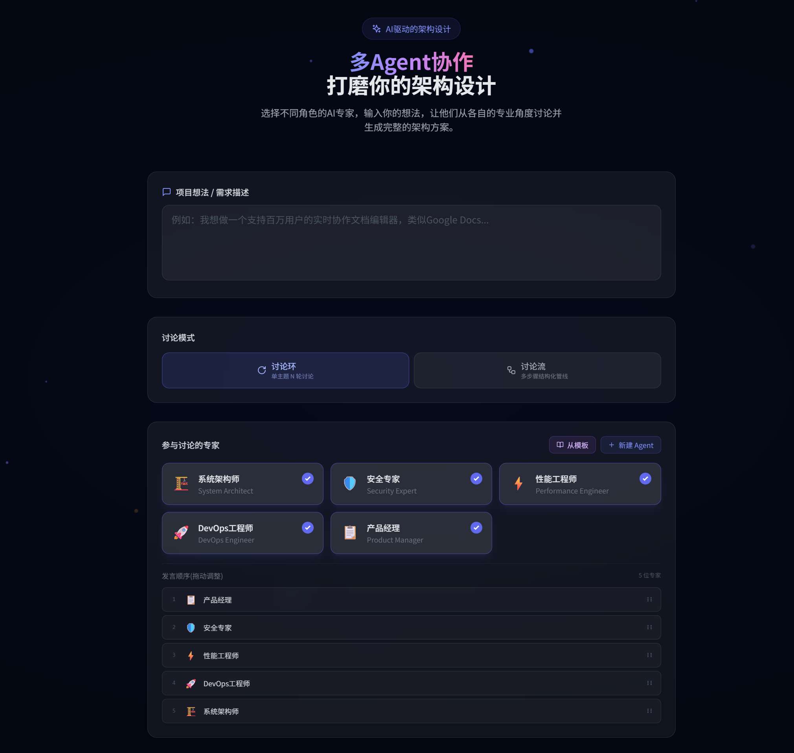

# ArchiMind - Multi-Agent Architecture Design System

[中文](./README.md)

> Multiple AI agents discuss your project from different professional perspectives, collaboratively producing high-quality architecture designs.

<p align="center">
  
</p>

## Features

- **Multi-Role Collaboration** — Customize agent roles (Architect, Security Expert, DBA, Performance Engineer, etc.) with independent system prompts and stances (neutral / challenge / support)
- **Two Discussion Modes** — Ring mode for quick brainstorming; Flow mode for step-by-step progression with dependency management and parallel execution
- **Built-in Professional Flow** — Default 8-step architecture workshop: Requirements → Capacity Estimation → High-Level Design → Data/API/Security in parallel → Deployment & Ops → Final Document
- **Editable Flows** — Clone the built-in flow to create custom versions; adjust steps, rounds, dependencies, and module grouping
- **Multi-Provider Support** — Configure multiple LLM providers simultaneously (OpenAI, DeepSeek, Gemini, OpenRouter, SiliconFlow, Ollama, etc.); assign providers per-agent or per-step
- **Token Control** — Configure `maxTokens` independently per provider to control response length
- **Real-time Streaming** — SSE-based live discussion visualization with pause/resume/stop controls
- **Architecture Document Generation** — Automatically generates a structured Markdown architecture document with Mermaid diagrams after discussion
- **History** — Auto-saves discussion records for review and follow-up discussions

## Tech Stack

| Layer | Technology |
|---|---|
| Frontend | React 18 + TypeScript + Tailwind CSS + Framer Motion + Vite |
| Backend | Python FastAPI + SSE (Server-Sent Events) |
| AI | OpenAI-compatible API (any service implementing `/v1/chat/completions`) |

## Getting Started

### Prerequisites

- Python 3.10+
- Node.js 18+
- At least one LLM API key

### Quick Start (Windows)

```bash
start.bat
```

### Manual Setup

**Backend:**
```bash
cd backend
pip install -r requirements.txt
# Optional: create .env file for default API key
# OPENAI_API_KEY=your-key
# OPENAI_BASE_URL=https://api.openai.com/v1
# OPENAI_MODEL=gpt-4
python main.py
```

**Frontend:**
```bash
cd frontend
npm install
npm run dev
```

Open http://localhost:5173 in your browser.

## Usage

1. **Configure Providers** — Click the settings icon, add LLM providers with API keys
2. **Set Up Agents** — Configure expert roles, adjust stances, and bind providers
3. **Enter Topic** — Describe your project idea or technical requirements
4. **Choose Mode** — Ring mode for quick discussion / Flow mode for structured progression
5. **Start Discussion** — Watch agents discuss in real-time; pause or inject feedback anytime
6. **Get Results** — Receive a complete architecture design document after discussion ends

## Project Structure

```
├── backend/
│   ├── main.py           # FastAPI server + Ring discussion engine
│   ├── flow_engine.py    # Flow discussion engine
│   ├── shared.py         # Shared models and utilities
│   └── requirements.txt
├── frontend/
│   ├── src/
│   │   ├── App.tsx              # App entry point
│   │   ├── components/          # UI components
│   │   ├── data/defaultFlow.ts  # Built-in flow definition
│   │   ├── types.ts             # Type definitions
│   │   └── utils/               # Utility functions
│   └── package.json
├── start.bat             # Windows one-click launcher
└── README.md
```

## License

MIT
